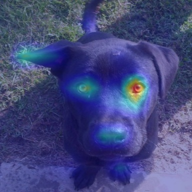

# Abbadon: Spatial Debiasing & Interpretable AI (MVP)

**Abbadon** is a Computer Vision (CV) and eXplainable AI (XAI) ecosystem. Its primary goal is to solve one of the most critical flaws in modern convolutional neural networks: **Spurious Correlations and Background Bias.**

Typically, if you train a binary classifier on cats and dogs, the network "cheats" by learning that dogs are usually on grass and cats are on sofas. Abbadon solves this through a dual **Teacher-Student** architecture, actively filtering out spatial noise and ensuring predictions are 100% anatomically and biologically driven, while remaining fully interpretable.

---

## 🧠 Architecture: The Teacher-Student System

The ecosystem is split into two cooperating neural networks driven by an explicit attention pipeline:

### 1. The Oracle (Daowa-maad)
A hyper-optimized semantic segmentation model (~15M parameters). Its job is to ingest raw images and generate a perfect "attention map" (silhouette) of the organic subject, completely ignoring the background environment.

### 2. The Student (Mendicant Bias)
The core classifier, built upon a **ConvNeXtV2 Atto** backbone.
Instead of receiving standard RGB inputs, the architecture's stem was modified (Stem Initialization) to accept **4 Channels (RGB + Oracle Mask)** via a custom *Attention Gate*.
- **Bias Defense:** During training, random *RGB Channel Dropout* is implemented. This shuts off color channels, forcing the network to predict based entirely on the Oracle's geometry, ensuring pure anatomical feature learning.

---

## 👁️ eXplainable AI (XAI) & VQA

This project is not a black box. Abbadon includes a comprehensive interpretability suite to prove its mathematical decisions are logically sound.

### Native Grad-CAM
The evaluation script (`gradcam_mendicant.py`) hooks into the gradients of the deepest stage of ConvNeXtV2 (`stages[-1].blocks[-1]`) to generate heatmaps. The results visually prove that the network focuses exclusively on the animal's eyes, ears, and facial structure, with zero attention leakage to the background.

### Zero-Shot VQA (The Voice of Mendicant Bias)
We bridge the mathematical output of the vision network with a **Multimodal LLM (Ollama + LLaVA)**. The `explain_mendicant.py` script takes the processed image, confidence score, and Grad-CAM, injecting a strict System Prompt to generate a clinical diagnostic report in natural language.

*(Note: Future iterations aim to connect ConvNeXt's latent space directly to the LLM via an MLP Projector).*

---

## 🛡️ Engineering Design Decisions

### 1. Why did the classifier converge to 99.4% in just 1 epoch? Is it Overfitting?
It is not overfitting; it is the expected mathematical outcome of **flawless Transfer Learning**. 
ConvNeXtV2 Atto was pre-trained on ImageNet (learning from 14 million images). The challenge wasn't teaching it what a cat is, but aligning its latent space to a binary task and coupling the 4th mask channel. 
By initializing the extra channel with the *average of the RGB weights* (avoiding a saddle point) and aggressively dropping the Learning Rate to `5e-5` in AdamW, we prevented **Catastrophic Forgetting**. The network simply re-mapped its pre-existing knowledge to the clean silhouette provided by the Oracle, achieving instant convergence.

### 2. Why build "Daowa-maad" instead of using SAM (Segment Anything)?
SAM 2 is a massive model (>300M parameters) that is **Prompt-Dependent** (it needs human clicks or YOLO bounding boxes to know what to segment). Daowa-maad is a lightweight (~15M parameters), entirely **Prompt-Free** model.
The reality is that *Daowa-maad is distilled SAM*. We used SAM offline for pseudo-labeling 25,000 images and transferred that knowledge (*Knowledge Distillation* via KL divergence) to Daowa-maad. This achieves SAM-level semantic precision but with real-time inference latency suitable for edge deployment.

---

## 🚀 Quick Start (XAI Inference Pipeline)

### 1. Generate Masks Offline (10x Speedup)
To avoid GPU bottlenecks during training, Oracle masks are pre-computed:
```bash
python source/utils/scripts/cache_oraculo.py
```

### 2. Train the Classifier
The Jupyter Notebook orchestrates the `MendicantDataset` (applying synchronized *Albumentations* geometry transforms to both the image and mask).
Run the cells in:
`source/train_mendicant.ipynb`

### 3. Live Interpretable Inference (XAI)
To analyze a new image, generate its Grad-CAM, and receive a natural language diagnostic report (requires local Ollama running `llava` or `llama3.2-vision`):
```bash
python source/utils/inference/explain_mendicant.py --img "source/data/PetImages/Dog/8.jpg" --model "llava"
```

---

---

## 🖼️ XAI Example: Mendicant Bias in Action

When processing a test image (`source/data/PetImages/Dog/8.jpg`), the pipeline generates the following Grad-CAM heatmap and natural language diagnostic report via the Ollama VQA integration:



**Mendicant Bias Transmission (LLaVA Output):**
> *In the image provided, the convolutional neural network sub-routine used for object detection has successfully identified a dog in the scene with an accuracy of 100.00%. The heatmap visualizes the areas within the input image where the CNN focused its attention to classify the subject as a canine.*
> 
> *The red zones highlight the following biological signatures:*
> *1. Shape and proportions: The network concentrated on areas that define the overall shape of a dog, including the head, neck, and body structure, which is characteristic of canines.*
> *2. Facial features: The eyes, nose, and mouth are significant areas of focus within the heatmap. These features are essential for recognizing a canine as they are highly distinctive.*
>
> *By processing the image with its neural network, Mendicant Bias detected these signatures and confirmed the presence of a dog in the scene.*

---

## 📚 Technical Appendix: Daowa-maad & Adversarial Training

*Documentation regarding Phase 1 of the project.*

### The Out-Of-Distribution (OOD) Problem
During early testing, Daowa-maad exhibited false positives with fur coats and fluffy carpets. To solve this, the model was adversarially fine-tuned using **ADE20K**, extracting examples of humans wearing similar fabrics and textures.

### Oracle Engineering Components
- **NegativeAwareBatchSampler**: Forces the DataLoader to maintain a fixed ratio (e.g., 13 positives, 3 negatives) so the model cannot ignore adversarial textures.
- **BurnInAdversarialLoss**: Combines Dice Loss and Boundary Loss (using SDF maps). In early epochs, Dice Loss dominates for stability. In later epochs, Boundary Loss refines perfect geometric edges.
- **Pre-computed SDF Maps**: Signed Distance Field calculations were removed from the synchronous DataLoader and pre-computed into `.npy` files, completely eliminating CPU stall bottlenecks on the server.
